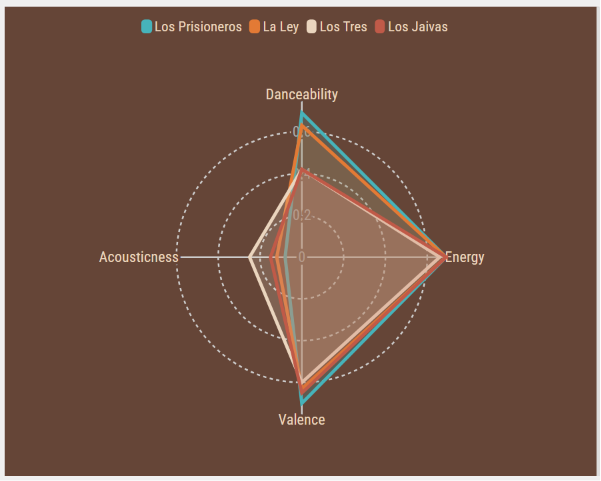
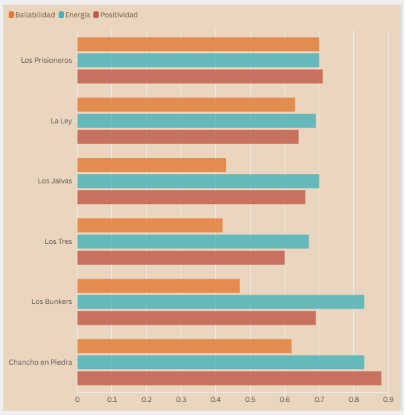
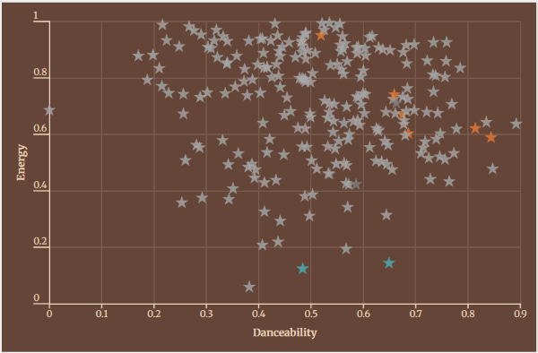

# Análisis de sus visualizaciones

### Análisis de sus visualizaciones en relación con la historia que están contando: ¿Qué dimensiones y mensajes quieren comunicar con ellas?

* **Visualización 1**: ADN de las grandes bandas (RADAR)
    * Esta visualización busca comunicar la "huella" de las agrupaciones clace. El objetivo es comparar los parámetros principales (Danceability, Energy, Valence y Acousticness).
    * La idea era mostrar visualmente contrastes drásticos: por ejemplo, como La Ley domina en un sonido electrónico y bailable frente a Los Jaivas que presentan la acústica más alta pero menor alcance masivo actual.


* **Visualización 2**: Atributos de un hit
    * Esta visualización busca aislar las características sonoras que comparten las 10 canciones más populares de nuestro catálogo histórico. El mensaje central es demostrar que el "éxito" sostenido en el tiempo no es aleatorio, sino que responde a un patrón rítmico específico que conectó masivamente con el público chileno, a excepción del caso anómalo (y exitoso) de Mon Laferte.



* **Visualización 3**: Gráfico dispersión
    * Es el clímax de los datos. Cruza las dos variables más importantes descubiertas: Bailabilidad (Eje X) con Energía (Eje Y). El gráfico expone contundentemente cómo los proyectos musicales calibraron sus composiciones para resonar en una "frecuencia óptima". Demuestra visualmente el clúster de himnos chilenos agrupados en el cuadrante de Alta Energía + Alta Bailabilidad.


### Código de cada una de ellas si existe.
* Se utilizó Flourish para la interactividad responsiva. Se utilizaron scripts de Flourish, los cuales fueron insertados `<iframe>` interactivo en el DOM. 
* Código Visualización 1: 
```
<div class="flourish-embed flourish-radar" data-src="visualisation/29488203">
    <script src="[https://public.flourish.studio/resources/embed.js](https://public.flourish.studio/resources/embed.js)"></script>
</div>
```
* Código Visualización 2:
```
<div class="flourish-embed flourish-chart" data-src="visualisation/29619771"><script src="https://public.flourish.studio/resources/embed.js"></script><noscript></noscript></div>
```

* Código Visualización 3: 
```
<div class="flourish-embed flourish-scatter" data-src="visualisation/29488808">
    <script src="[https://public.flourish.studio/resources/embed.js](https://public.flourish.studio/resources/embed.js)"></script>
</div>

```

### Ficha técnica de las bases de datos
Los datos que alimentan las visualizaciones se trabajaron con la siguiente metodología:
* Base de datos: `mejorescancionesrock.csv` 
* Fuente primaria: API de Spotify
* Fuente secundaria:  Listado curado de la revista Rockaxis ("Las 250 canciones más importantes del rock chileno").
* Universo de Datos: 232 canciones procesadas y validadas.
* Procesamiento Técnico: Limpieza de datos nulos, normalización de escalas acústicas (de 0.0 a 1.0) utilizando librerías de Python (Pandas), y cruce estructurado con la métrica actual de Popularidad de Spotify.